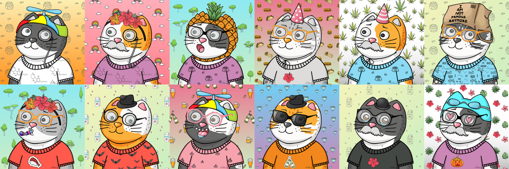
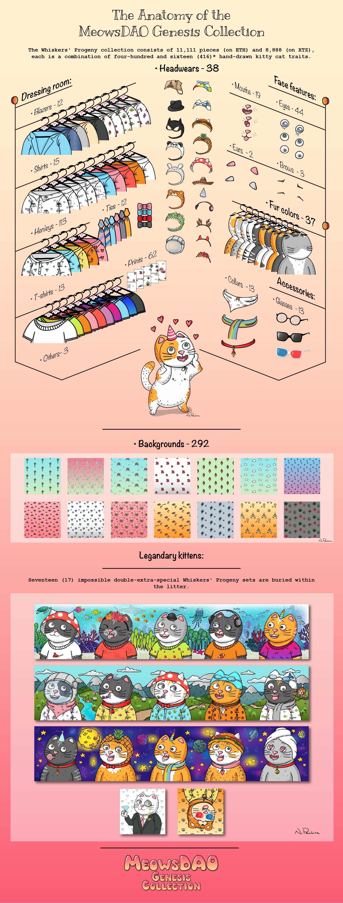
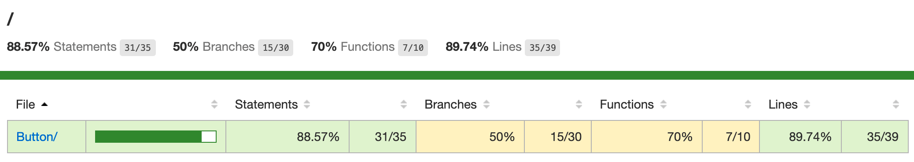

# Meows(DAO)'s Genesis Collection, ERC-721 Generative NFT Collection
## A release of ten thousand kitty cat NFTs, based on the the character Mr. Whiskers, Inventor of Proof of Meow™

## Mint a Progeny Immediately
If you have not minted your own Mr. Whiskers' Progeny, head to [0x7932903a11317f8848BC5aC4173F7EdAEC38EcE8](https://etherscan.io/address/0x7932903a11317f8848bc5ac4173f7edaec38ece8#code).

<p align="center">
  
</p>

## Meows(DAO) Genesis Collection
Introducing the Meows(DAO)'s Genesis NFT collection. These hand-drawn illustrations and characters are brought to life by graphic designer and artist Natalia Pankina (@natashapankina5) with a little help from generative software called Layer-cake (contributed by @atsignhandle and @gibbinator). The NFT collection, based around Natasha's illustrated character Mr. Whiskers, Inventor of the consensus mechanism Proof of Meow\u2122 and leader of the CompuGlobalHyperMega (DAO) - and his Progeny.  The Progeny NFT Collection are a total population of ten thousand (10,000) adorable kitty cat image assets, each Progeny is stylized by a unique set of attributes, outfits for example range from natural with nipples to t-shirt, to formal button down shirts, including tie and a blazer. The Progeny NFT Collection makes use of additional accessories including glasses, hats, and scarves. Other attributes include background, fur, ears, brows, eyes, nose, head ware, glasses, shirt patterns and more. No two kitty cat Progeny are identical, from millions of possibilities reduced to the ten thousand hand tuned pieces with a handful of compositions including Progeny's WallStreetBets' diamond hands and the Sets. A very small number of NFTs are composed of a wide background (10417 pixels) divided into five (5) panels - thus when placed lengthwise, a composite background emerges as a single artwork, the Sets. Keen collectors will no doubt seek out joining these pieces in composing collections. The Genesis Collection includes three Sets the Alps, Space, and the Ocean.
 [opensea.store-front.json](docs/meowsdao.eth.store-front.json)

<p align="center">
  
</p>

---

## ERC-721 or Ethereum NFT Generative Collection
After [Layer-cake]("https://github.com/pleasemarkdarkly/layer-cake"), our generative image composite stack, produces over ten thousand (10,000) adorable kitty cat images, accompanying metadata files, what now? [This contract](contracts/Whiskers/MeowsDAO.sol) a fully compliant ERC-721 token, contains the necessary additional functions for the following: 
* Provenance Hash, hash of the hashes of all images, provable that the generation of the collection was the result of a single event.
* Implements a baseURI (an IPFS wrapped folder houses all the NFT metadata) where the token_id is concatenated with the baseURI to form the URI.
* Sale activation - positions the minting index so that the start position is unknown.
* Team allocation, claimable kittyCats for the team
* adoptKittyCat function whose arguments are kittyPrice * kittyCount, kittyCount 

Using the BaseURI, enumerating over the JSON, any user can verify the properties of each character, its hash, and the aggregate, in order hash of the entire collection - leaving no room for feeling like a cat toy.

## Environment
For beginners and ease of use, I generated throwaway accounts for the environment variables as to ensure this project just builds after cloning.

```
TESTNET_PUBLIC_KEY=''
TESTNET_PRIVATE_KEY=''
TESTNET_PRIVATE_MNEMONIC=''
INFURA_API_KEY=''
ETHERSCAN_API_KEY=''
MAINNET_ALCHEMY_API_KEY=''
ROPSTEN_ALCHEMY_API_KEY=''
RINKEBY_ALCHEMY_API_KEY=''
REPORT_GAS=''
GANACHE=''
```

## Opensea
The [Opensea](https://opensea.io) is a decentralized marketplace for the Ethereum ecosystem. It is a place where anyone can sell and buy digital assets. This contract includes a specific function used by the marketplace in order to populate a storefront. The function returns a [JSON file](docs/meowsdao.eth.store-front.json) that contains the storefront metadata.

## Reusing the project
Contract inherits from a specific version of Open Zeppelin libraries, `@openzeppelin/contracts@3.1.0-solc-0.7`, and care should be taken when building the project. 
```bash
yarn add @openzeppelin/contracts@3.1.0-solc-0.7
```
## Configuration
### Variables
* Set constants in `config/index.ts`
  * Name
  * Symbol
  * Max Tokens
  * Sales start
### Function calls
* Constructor
* setContractURI()
* setProvenanceHash()
* setBaseURI()
* flipSalesState()

## Build
```bash
git clone https://github.com/atsignhandle/meowdao-erc721-contract
yarn
yarn run build 
yarn run compile 
yarn run test
npx hardhat run --network rinkeby ./scripts/deploy.ts 
```
The deployment should return an address, for example, here is what I received.
```
0x2D158DfF69097af8941E6a06E634B0F0A8c836Cf
```
Compare the deployment constructor arguments, which I referenced from `config/index.ts` and either use the `arguments.js` or pass into the following function verbatim.The following will verify the contract, in effect, publish the source code on Etherscan. 
```
npx hardhat verify --network rinkeby 0x2D158DfF69097af8941E6a06E634B0F0A8c836Cf "Meows(DAO)'s Genesis Collection" "MEOWsDAO" 9999 1 => 
```
```
Compiling 1 file with 0.7.0
Successfully submitted source code for contract
contracts/Whiskers/MeowsDAO.sol:MeowsDAO at 0x2D158DfF69097af8941E6a06E634B0F0A8c836Cf
for verification on Etherscan. Waiting for verification result...

Successfully verified contract MeowsDAO on Etherscan.
https://ropsten.etherscan.io/address/0x2D158DfF69097af8941E6a06E634B0F0A8c836Cf#code
```

---
## Example NFTs
<p align="center">
  
</p>
---

## Deployed contract
MeowsDAO contract is on mainnet, mint your allocation [here.](https://etherscan.io/address/0x7932903a11317f8848bc5ac4173f7edaec38ece8).

### Coverage
<p align="center">
  
</p>

### Output


```sh
yarn 

➤ YN0000: ┌ Resolution step
➤ YN0002: │ @codechecks/client@npm:0.1.10 doesn't provide typescript (paa1ae), requested by ts-node
➤ YN0002: │ hardhat-gas-reporter@npm:1.0.4 [a33c8] doesn't provide @codechecks/client (pf8486), requested by eth-gas-reporter
➤ YN0002: │ typechain@npm:3.0.0 doesn't provide typescript (p4ba7f), requested by ts-essentials
➤ YN0002: │ typechain@npm:5.0.0 doesn't provide typescript (p2e73e), requested by ts-essentials
➤ YN0000: │ Some peer dependencies are incorrectly met; run yarn explain peer-requirements <hash> for details, where <hash> is the six-letter p-prefixed code
➤ YN0000: └ Completed in 0s 221ms
➤ YN0000: ┌ Fetch step
➤ YN0013: │ yargs@npm:13.3.2 can't be found in the cache and will be fetched from the remote registry
➤ YN0013: │ yargs@npm:16.2.0 can't be found in the cache and will be fetched from the remote registry
➤ YN0013: │ yargs@npm:4.8.1 can't be found in the cache and will be fetched from the remote registry
➤ YN0013: │ yn@npm:3.1.1 can't be found in the cache and will be fetched from the remote registry
➤ YN0013: │ yocto-queue@npm:0.1.0 can't be found in the cache and will be fetched from the remote registry
➤ YN0000: └ Completed in 4s 572ms
➤ YN0000: ┌ Link step
➤ YN0000: └ Completed in 0s 781ms
➤ YN0000: Done with warnings in 5s 764ms
Time: 0h:00m:06s          

yarn run build

> meowsdao@1.0.0 compile
> npx hardhat compile

Compiling 16 files with 0.7.0
@openzeppelin/contracts/access/Ownable.sol:26:5: Warning: Visibility for constructor is ignored. If you want the contract to be non-deployable, making it "abstract" is sufficient.
    constructor () internal {
    ^ (Relevant source part starts here and spans across multiple lines).

@openzeppelin/contracts/introspection/ERC165.sol:24:5: Warning: Visibility for constructor is ignored. If you want the contract to be non-deployable, making it "abstract" is sufficient.
    constructor () internal {
    ^ (Relevant source part starts here and spans across multiple lines).

@openzeppelin/contracts/token/ERC721/ERC721.sol:93:5: Warning: Visibility for constructor is ignored. If you want the contract to be non-deployable, making it "abstract" is sufficient.
    constructor (string memory name_, string memory symbol_) public {
    ^ (Relevant source part starts here and spans across multiple lines).

Generating typings for: 16 artifacts in dir: typechain for target: ethers-v5
Successfully generated 21 typings!
Compilation finished successfully
Time: 0h:00m:10s  

yarn run compile 

Nothing to compile
No need to generate any newer typings.

```